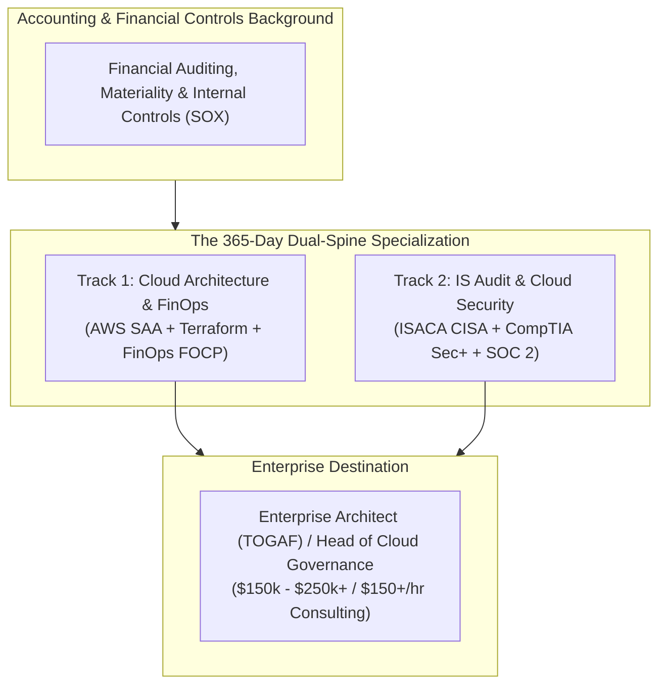

# Cloud Architecture, IS Audit & Enterprise Governance Engine

> **A specialized, career-grade engineering curriculum designed for accounting and computing professionals to master Cloud Architecture, Information Systems (IS) Audit, FinOps, and Enterprise Architecture—self-funding elite credentials through high-value consulting.**

---

## 🎯 The Strategic Positioning: Accounting Meets Enterprise Cloud

The technology industry is flooded with junior developers who can write basic code but cannot read a balance sheet, understand regulatory compliance, or optimize cloud unit economics.

By combining your **Accounting & Financial Controls background** with **Cloud Architecture & IS Audit**, you target the highest-leverage, most lucrative intersection in enterprise technology:



---

## 🔁 The Compounding 4-Quarter Execution Model

Unlike fragmented programs that jump between unrelated fields, **every quarter directly builds on the infrastructure, controls, and clients of the previous quarter**:

```
[ Q1: Months 01–03 ] Cloud Architecture & Networking ────► Earn ≥ $400  ────► AWS Solutions Architect (SAA)
[ Q2: Months 04–06 ] IaC (Terraform) & Cloud FinOps ─────► Earn ≥ $800  ────► Terraform Assoc + FinOps (FOCP)
[ Q3: Months 07–09 ] IS Audit, ITGC & SOC 2 Compliance ──► Earn ≥ $1,200 ───► ISACA CISA / CompTIA Security+
[ Q4: Months 10–12 ] Enterprise Architecture & Gov (TOGAF)► Earn ≥ $2,000 ───► TOGAF 10 / AWS Security Specialty
```

---

## 💰 The High-Ticket Monetization Engine

Because your skills solve **direct financial risk and regulatory roadblocks** for businesses, you do not compete on low-wage freelancer platforms. You sell productized enterprise solutions:

| Phase / Focus | High-Ticket Service Offer | Target Client | Typical Engagement Fee | Self-Funded Industry Certification |
| :--- | :--- | :--- | :--- | :--- |
| **Q1: Cloud Architecture** | **AWS Architecture & Resilience Review** | Seed/Series A Startups | **$350 – $600** | **AWS SAA-C03** ($150) |
| **Q2: IaC & FinOps** | **Cloud Cost Optimization / FinOps Sprint** | Companies spending $3k–$20k/mo on AWS | **$600 – $1,200** | **Terraform** ($70) + **FinOps FOCP** ($300) |
| **Q3: IS Audit & ITGC** | **Pre-Audit SOC 2 & ITGC Readiness Review** | B2B SaaS closing enterprise deals | **$1,000 – $2,500** | **ISACA CISA** ($575) or **Security+** ($392) |
| **Q4: Enterprise Governance** | **Cloud Governance & Architecture Blueprint** | Mid-market firms preparing for scale | **$1,500 – $3,500** | **TOGAF 10** ($620) or **AWS Security** ($300) |

---

## 🏛️ Proof-of-Work (The Real Exams)

You do not take classroom quizzes. You build and document one continuous, compounding enterprise platform:
1. **Q1 PoW:** *AetherCloud* — Highly available, multi-AZ AWS VPC architecture with automated disaster recovery and health checks.
2. **Q2 PoW:** *AetherFinOps* — Complete Terraform modularization of the infrastructure with automated Infracost CI/CD cost checks and AWS Cost Allocation tags.
3. **Q3 PoW:** *AetherAudit* — Automated Cloud Compliance & SOC 2 / ITGC continuous monitoring engine using AWS Config, CloudTrail, and Open Policy Agent.
4. **Q4 PoW:** *AetherEnterprise* — Full TOGAF 10 Enterprise Architecture Dossier, capability heatmaps, and executive IT strategy alignment roadmap.

---

## 🗂️ Curriculum & Playbook Index

- [**Master 365-Day Roadmap (`curriculum/00_master_roadmap_365.md`)**](file:///home/ghiffar-sabda/personal_compsci/curriculum/00_master_roadmap_365.md) — 52-week compounding sprint plan.
- [**Phase 1: Cloud Architecture & Networking (`curriculum/01_phase1_systems_networking_cloud.md`)**](file:///home/ghiffar-sabda/personal_compsci/curriculum/01_phase1_systems_networking_cloud.md) — AWS core, VPC networking, IAM, high availability, AWS SAA.
- [**Phase 2: IaC & Cloud FinOps (`curriculum/02_phase2_devops_k8s_platform.md`)**](file:///home/ghiffar-sabda/personal_compsci/curriculum/02_phase2_devops_k8s_platform.md) — Terraform, state management, AWS unit economics, FinOps Foundation, Infracost.
- [**Phase 3: IS Audit, ITGC & SOC 2 (`curriculum/03_phase3_data_engineering_ai.md`)**](file:///home/ghiffar-sabda/personal_compsci/curriculum/03_phase3_data_engineering_ai.md) — SOX 404 ITGC, SOC 2 Type II controls, continuous cloud compliance, ISACA CISA.
- [**Phase 4: Enterprise Architecture & Governance (`curriculum/04_phase4_cybersecurity_devsecops.md`)**](file:///home/ghiffar-sabda/personal_compsci/curriculum/04_phase4_cybersecurity_devsecops.md) — TOGAF 10 standard, business-IT capability mapping, cloud security governance.
- [**Focused Certification Matrix (`certs/certification_matrix.md`)**](file:///home/ghiffar-sabda/personal_compsci/certs/certification_matrix.md) — Target credentials, voucher costs, and client earning gates.
- [**Consulting Acquisition Playbook (`monetization/client_acquisition_playbook.md`)**](file:///home/ghiffar-sabda/personal_compsci/monetization/client_acquisition_playbook.md) — Finding startups, FinOps audit pitches, SOC 2 readiness proposals.
- [**Proposal & Contract Templates (`monetization/proposal_and_outreach_templates.md`)**](file:///home/ghiffar-sabda/personal_compsci/monetization/proposal_and_outreach_templates.md) — SOW contracts, FinOps audit proposals, executive summaries.
- [**Obsidian Knowledge Vault Spec (`standards/engineering_vault_spec.md`)**](file:///home/ghiffar-sabda/personal_compsci/standards/engineering_vault_spec.md) — Structure for tracking controls, ADRs, and financial ledgers.

---

## 📋 The 4 Iron Rules

1. **The 365-Day Clock:** Velocity is life. 52 weeks of compounding execution toward Enterprise Architecture.
2. **Zero Out-of-Pocket Rule:** All certification vouchers (AWS SAA, Terraform, FinOps FOCP, CISA, TOGAF) must be funded 100% by consulting revenue.
3. **Skin in the Game:** Earn at least 1.5× the cost of the exam through domain consulting before booking your exam date.
4. **Public Proof-of-Work:** Every deliverable is backed by real Terraform code, live architecture diagrams, compliance audit reports, and executive case studies.


