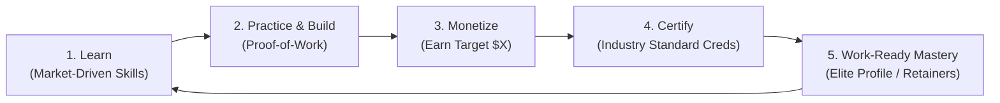

# Applied Computing Apprenticeship & Venture Engine

> **A self-directed, career-grade engineering bootcamp where you acquire monetizable production skills, build verifiable proof-of-work, and self-fund industry-recognized credentials through real market earnings.**

---

## 🎯 The Core Philosophy: The 5-Phase Flywheel

Traditional education has it backwards: you pay exorbitant tuition upfront, listen to abstract theory, take artificial multiple-choice quizzes, and graduate with zero market proof.

This curriculum is structured as a **self-funding engineering venture**:

1. **Learn:** Acquire modern, high-leverage engineering skills actually used by industry leaders today (no obsolete academic curricula).
2. **Practice & Build (Proof-of-Work):** Complete production-grade systems—deployed to live infrastructure, load-tested, secured, and documented with architecture decision records (ADRs). No toy to-do apps.
3. **Monetize:** Put the skill immediately to work in the market. Land freelance gigs, build automation for businesses, win open-source bounties, or ship micro-tools to hit a specific dollar target.
4. **Certify:** Use the earned capital to pay for rigorous, globally recognized vendor credentials (e.g., AWS Solutions Architect, Kubernetes CKA, OffSec OSCP, Databricks). **$0 out of pocket.**
5. **Mastery:** Graduate with real market proof: live code running in production, paying client testimonials, verifiable revenue, and gold-standard industry badges.

---

## ⚔️ Proof-of-Work vs. The Old Model

| Traditional Academic Degree | Generic Coding Bootcamp | **Applied Venture & Apprenticeship Model** |
| :--- | :--- | :--- |
| **Exams:** Multiple-choice / memory quizzes | **Exams:** Toy portfolio cloned from class | **Proof-of-Work:** Live deployed software, stress tests, uptime metrics, RFCs |
| **Validation:** Paper GPA & diploma | **Validation:** Certificate of completion | **Validation:** Recognized proctored vendor certs + market revenue receipts |
| **Cost:** Heavy tuition / debt | **Cost:** Thousands paid upfront | **Self-Funding:** You earn during the course to pay for your certifications |
| **Code State:** Local `localhost:3000` | **Code State:** Hosted on free tiers without tests | **Production:** CI/CD, IaC, observability, security hardening, real traffic |
| **Outcome:** Junior hoping for interviews | **Outcome:** Cloned resume in saturated pile | **Outcome:** Battle-tested engineer with demonstrated market value |

---

## 💰 The Self-Funding Equation: "Earn Before You Certify"

Earning is not an optional extracurricular—**it is a required graduation metric**. If a skill cannot generate economic value, you have not mastered it to a professional standard.

Every stage pairs a **Production Skill** with a **Monetization Playbook** and a **Target Certification Voucher**:

| Track / Competency | Proof-of-Work (The Real Exam) | Market Monetization Channel | Target Earnings | Self-Funded Industry Certification |
| :--- | :--- | :--- | :--- | :--- |
| **Cloud & Full-Stack Systems** | Deployed multi-tenant SaaS core, event queues, Stripe billing, CI/CD | Freelance API integrations, custom scrapers, B2B tool builds (Upwork/Contra) | **$250 – $500** | **AWS Solutions Architect (Associate)** ($150) |
| **DevOps & Platform Engineering** | Zero-downtime GitOps pipeline, Terraform infra, Kubernetes cluster with observability | Cloud cost optimization audits, Dockerizing legacy stacks, CI/CD setup for agencies | **$500 – $800** | **Certified Kubernetes Administrator (CKA)** ($395) |
| **Data Engineering & Applied AI** | Production ETL pipeline, vector search RAG system with automated evaluation harness | Custom AI chatbots for local SMBs, automated invoice/data pipelines, data cleansing | **$400 – $1,000** | **Databricks Data Engineer** or **GCP Professional Data Eng** ($200) |
| **Cybersecurity & AppSec** | Documented vulnerability write-ups, automated SAST/DAST CI/CD integration, honeypots | Bug bounties (HackerOne, Bugcrowd), security reviews for startups, smart contract audits | **$500 – $2,000** | **CompTIA Security+** ($392) or **OffSec OSCP** |

---

## 📋 The 3 Iron Rules

1. **Zero Out-of-Pocket Rule:** All certification exam vouchers, domain registrations, and cloud hosting costs past the setup phase must be funded exclusively by revenue generated from the skills learned.
2. **Skin in the Game:** You do not sit for an industry certification until you have earned at least 1.5× the cost of the exam through market work in that specific domain.
3. **Public Accountability:** Every proof-of-work deliverable must be public: a live domain, a clean open-source repository, an architectural teardown, and verifiable performance/monitoring metrics.

