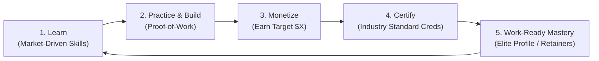

# Applied Computing Apprenticeship & Venture Engine

> **A self-directed, career-grade engineering bootcamp where you acquire monetizable production skills, build verifiable proof-of-work, and self-fund industry-recognized credentials through real market earnings.**

---

## 🎯 The Core Philosophy: The 5-Phase Flywheel

Traditional education has it backwards: you pay exorbitant tuition upfront, listen to abstract theory, take artificial multiple-choice quizzes, and graduate with zero market proof.

This curriculum is structured as a **self-funding engineering venture**:



1. **Learn:** Acquire modern, high-leverage engineering skills actually used by industry leaders today (no obsolete academic curricula).
2. **Practice & Build (Proof-of-Work):** Complete production-grade systems—deployed to live infrastructure, load-tested, secured, and documented with architecture decision records (ADRs). No toy to-do apps.
3. **Monetize:** Put the skill immediately to work in the market. Land freelance gigs, build automation for businesses, win open-source bounties, or ship micro-tools to hit a specific dollar target.
4. **Certify:** Use the earned capital to pay for rigorous, globally recognized vendor credentials (e.g., AWS Solutions Architect, Kubernetes CKA, OffSec OSCP, Databricks). **$0 out of pocket.**
5. **Mastery:** Graduate with real market proof: live code running in production, paying client testimonials, verifiable revenue, and gold-standard industry badges.

---

## ⚔️ Proof-of-Work vs. The Old Model

| Traditional Academic Degree | Generic Coding Bootcamp | **Applied Venture & Apprenticeship Model** |
| :--- | :--- | :--- |
| **Exams:** Multiple-choice / memory quizzes | **Exams:** Toy portfolio cloned from class | **Proof-of-Work:** Live deployed software, stress tests, uptime metrics, RFCs |
| **Validation:** Paper GPA & diploma | **Validation:** Certificate of completion | **Validation:** Recognized proctored vendor certs + market revenue receipts |
| **Cost:** Heavy tuition / debt | **Cost:** Thousands paid upfront | **Self-Funding:** You earn during the course to pay for your certifications |
| **Code State:** Local `localhost:3000` | **Code State:** Hosted on free tiers without tests | **Production:** CI/CD, IaC, observability, security hardening, real traffic |
| **Outcome:** Junior hoping for interviews | **Outcome:** Cloned resume in saturated pile | **Outcome:** Battle-tested engineer with demonstrated market value |

---

## 💰 The Self-Funding Equation: "Earn Before You Certify"

Earning is not an optional extracurricular—**it is a required graduation metric**. If a skill cannot generate economic value, you have not mastered it to a professional standard.

Every stage pairs a **Production Skill** with a **Monetization Playbook** and a **Target Certification Voucher**:

| Track / Competency | Proof-of-Work (The Real Exam) | Market Monetization Channel | Target Earnings | Self-Funded Industry Certification |
| :--- | :--- | :--- | :--- | :--- |
| **Cloud & Full-Stack Systems** | Deployed multi-tenant SaaS core, event queues, Stripe billing, CI/CD | Freelance API integrations, custom scrapers, B2B tool builds (Upwork/Contra) | **$250 – $500** | **AWS Solutions Architect (Associate)** ($150) |
| **DevOps & Platform Engineering** | Zero-downtime GitOps pipeline, Terraform infra, Kubernetes cluster with observability | Cloud cost optimization audits, Dockerizing legacy stacks, CI/CD setup for agencies | **$500 – $800** | **Certified Kubernetes Administrator (CKA)** ($395) |
| **Data Engineering & Applied AI** | Production ETL pipeline, vector search RAG system with automated evaluation harness | Custom AI chatbots for local SMBs, automated invoice/data pipelines, data cleansing | **$400 – $1,000** | **Databricks Data Engineer** or **GCP Professional Data Eng** ($200) |
| **Cybersecurity & AppSec** | Documented vulnerability write-ups, automated SAST/DAST CI/CD integration, honeypots | Bug bounties (HackerOne, Bugcrowd), security reviews for startups, smart contract audits | **$500 – $2,000** | **CompTIA Security+** ($392) or **OffSec OSCP** |

---

## ⚡ The Velocity Mandate: 1 Year (365 Days) Hard Deadline

> **"Speed loves money. Intelligence requires speed."**

This is not a relaxed 4-year academic stroll. It is an aggressive, high-density **1-year (365-day) fast track** executed with uncompromising discipline. 

Deliberate speed compresses feedback loops: the faster you ship to production, the faster the market tests your code, the faster you get paid, and the faster you certify.

### 📅 The 4-Quarter Execution Cadence (90 Days Per Horizon)

Each 90-day sprint is a complete, self-contained **Learn $\to$ Build $\to$ Monetize $\to$ Certify** loop:

```
[ Days 001 – 090 ] Q1: Modern Full-Stack & Cloud Systems ─────► Earn ≥ $300  ─────► AWS SAA-C03 Passed
[ Days 091 – 180 ] Q2: DevOps, K8s & Platform Engineering ──► Earn ≥ $600  ─────► CKA Passed
[ Days 181 – 270 ] Q3: Data Pipelines & Applied AI Systems ──► Earn ≥ $800  ─────► Databricks / GCP PDE Passed
[ Days 271 – 365 ] Q4: Security Hardening, Scale & Outbound ─► Earn ≥ $1,500 ───► Security+ / OSCP Passed
```

**By Day 365:** You stand with **4 production systems running live**, **4 recognized gold-standard industry credentials**, verifiable client receipts/bounties, and an undeniable proof-of-work track record that commands elite engineering compensation or independent contract retainers.

---

## 🗂️ The Complete Curriculum & Playbook Index

Everything in this repository is designed as an executable, production-grade operating system:

### 1. The Core 365-Day Curriculum
- [**Master 365-Day Roadmap (`curriculum/00_master_roadmap_365.md`)**](file:///home/ghiffar-sabda/personal_compsci/curriculum/00_master_roadmap_365.md) — 52-week breakdown, weekly velocity cadence, and milestone checkpoints.
- [**Phase 1: Systems, Networking & Cloud-Native (`curriculum/01_phase1_systems_networking_cloud.md`)**](file:///home/ghiffar-sabda/personal_compsci/curriculum/01_phase1_systems_networking_cloud.md) — Linux kernel, TCP/IP, Go systems, PostgreSQL internals, AWS architecture, PulseEngine capstone, AWS SAA / CCNA.
- [**Phase 2: DevOps, Kubernetes & Platform Engineering (`curriculum/02_phase2_devops_k8s_platform.md`)**](file:///home/ghiffar-sabda/personal_compsci/curriculum/02_phase2_devops_k8s_platform.md) — Containers, Terraform IaC, K8s cluster admin, GitOps (ArgoCD), Prometheus/Grafana, CKA & Terraform certs.
- [**Phase 3: Data Engineering, Big Data & Applied AI (`curriculum/03_phase3_data_engineering_ai.md`)**](file:///home/ghiffar-sabda/personal_compsci/curriculum/03_phase3_data_engineering_ai.md) — dbt, PySpark, Delta Lake Medallion architecture, Kafka streaming, Production RAG, Databricks & Snowflake certs.
- [**Phase 4: Cybersecurity, DevSecOps & Enterprise Hardening (`curriculum/04_phase4_cybersecurity_devsecops.md`)**](file:///home/ghiffar-sabda/personal_compsci/curriculum/04_phase4_cybersecurity_devsecops.md) — OWASP Top 10, penetration testing, automated DevSecOps CI/CD, Falco runtime security, CompTIA Security+, CKS, OSCP.

### 2. Industry Certifications & Economics
- [**Diverse Certification Matrix (`certs/certification_matrix.md`)**](file:///home/ghiffar-sabda/personal_compsci/certs/certification_matrix.md) — 12 gold-standard industry credentials (AWS, GCP, CNCF CKA/CKS, Cisco CCNA, Databricks, Snowflake, CompTIA, OffSec OSCP), exam costs, and earning thresholds.

### 3. Monetization Playbooks & Sales Scripts
- [**Client Acquisition Playbook (`monetization/client_acquisition_playbook.md`)**](file:///home/ghiffar-sabda/personal_compsci/monetization/client_acquisition_playbook.md) — Upwork bidding, cold outbound to funded startups, productized consulting audits, 60/40 capital split.
- [**Proposal & Outreach Templates (`monetization/proposal_and_outreach_templates.md`)**](file:///home/ghiffar-sabda/personal_compsci/monetization/proposal_and_outreach_templates.md) — Ready-to-deploy Upwork proposals, founder cold emails, 1-page Scope of Work (SOW) agreement.
- [**Bounties & Micro-SaaS Guide (`monetization/bounty_and_micro_saas_guide.md`)**](file:///home/ghiffar-sabda/personal_compsci/monetization/bounty_and_micro_saas_guide.md) — Open source bounties (Algora, Polar.sh), ethical bug bounties (HackerOne), paid developer writing, and utility APIs.

### 4. Engineering Standards & Obsidian Vault
- [**Proof-of-Work Quality Rubric (`standards/proof_of_work_rubric.md`)**](file:///home/ghiffar-sabda/personal_compsci/standards/proof_of_work_rubric.md) — The 6 pillars of hireable production projects: RFCs/ADRs, CI/CD, live deployment, telemetry, K6 stress testing, and security hardening.
- [**Obsidian Engineering Vault Spec (`standards/engineering_vault_spec.md`)**](file:///home/ghiffar-sabda/personal_compsci/standards/engineering_vault_spec.md) — Vault folder structure, ADR templates, daily execution logs, and self-funding financial ledger.

---

## 📋 The 4 Iron Rules

1. **The 365-Day Clock:** Every day without code shipped or outreach sent is negative interest. Velocity is a core engineering metric.
2. **Zero Out-of-Pocket Rule:** All certification exam vouchers, domain registrations, and cloud hosting costs past the setup phase must be funded exclusively by revenue generated from the skills learned.
3. **Skin in the Game:** You do not sit for an industry certification until you have earned at least 1.5× the cost of the exam through market work in that specific domain.
4. **Public Accountability:** Every proof-of-work deliverable must be public: a live domain, a clean open-source repository, an architectural teardown, and verifiable performance/monitoring metrics.


